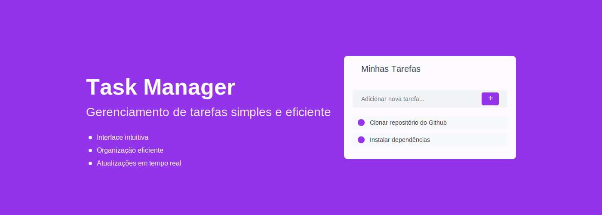

<div align="center">


# Task Manager

Sistema de gerenciamento de tarefas com interface moderna e intuitiva.
</div>

## ⚡ Instalação Rápida

```bash
# Clonar o repositório
git clone [url-do-seu-repositorio]

# Instalar dependências da API
cd api
npm install

# Instalar dependências do Frontend
cd ../frontend
npm install
```

## 🚀 Configuração

### Banco de Dados
1. Acesse `api/config/readme.md`
2. Siga as instruções do script para criar o banco localmente

### Variáveis de Ambiente
1. **API**
```bash
cd api
cp .env.example .env
```

2. **Frontend**
```bash
cd frontend
cp .env.example .env
```
Configure as variáveis de acordo com os exemplos fornecidos.

## 💻 Executando o Projeto
```bash
# API
cd api
npm start

# Frontend
cd frontend
npm run dev
```
Acesse: `http://localhost:3000`

## 🛠️ Tecnologias
- **Frontend:** React/Next.js
- **Backend:** Node.js
- **Banco de Dados:** MySQL

## ✨ Funcionalidades
- Sistema de gerenciamento de tarefas
- Interface moderna e responsiva
- Atualizações em tempo real
- Organização intuitiva

## 📝 Requisitos
- Node.js
- npm ou yarn
- Banco de dados local

## 🔍 Observações Importantes
- Configure todas as variáveis de ambiente antes de iniciar
- API precisa estar rodando para o frontend funcionar
- Confira os arquivos .env.example para as configurações necessárias

## 📫 Suporte
Para suporte, abra uma issue no repositório.

---

<div align="center">
Desenvolvido com 💜 por Natan O. Marinho
  
</div>
